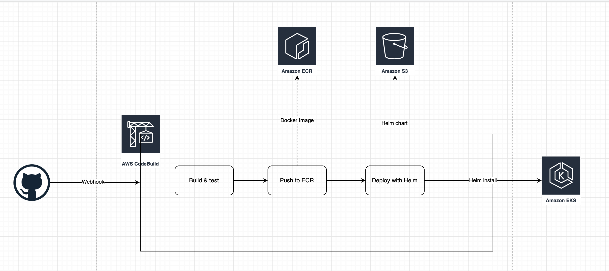

# Kubernetes


### This project contains:
- Helm chart to deploy our applications
- Some Kubernetes objects like
  - Deployment
  - Service
  - ConfigMap containing the environment variables
  
The application will be built and deployed using AWS CodeBuild (buildspec.yaml) which is in the project root folder

### How to install the chart
```
cd k8s/superb-helm-chart
helm install -f values.yaml --generate-name .
```
